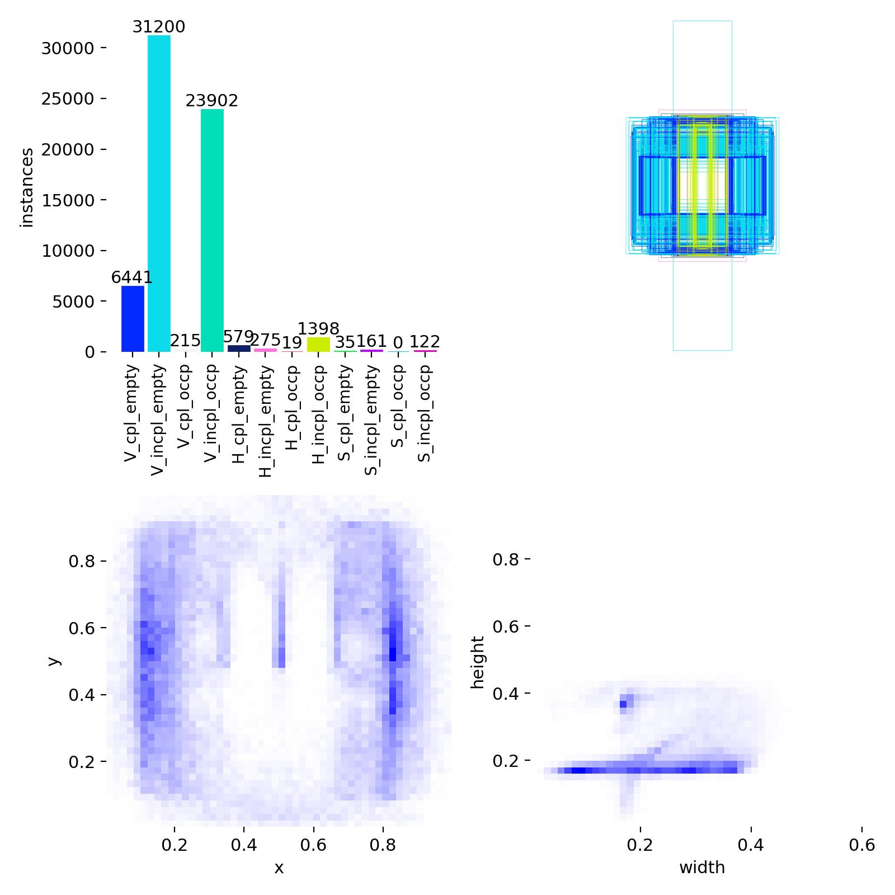
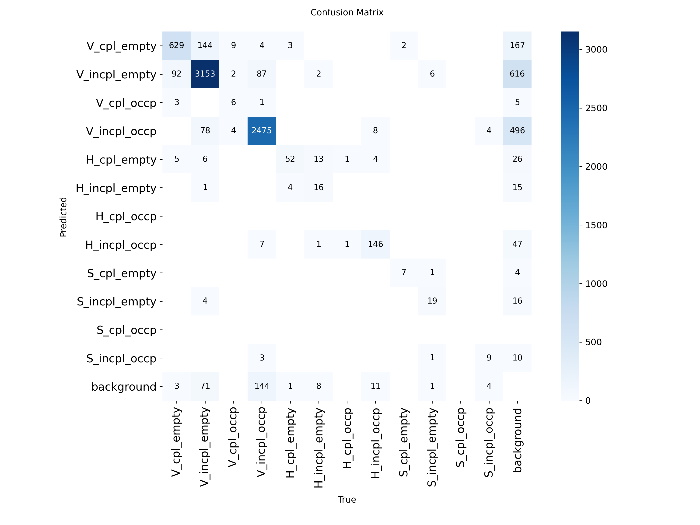
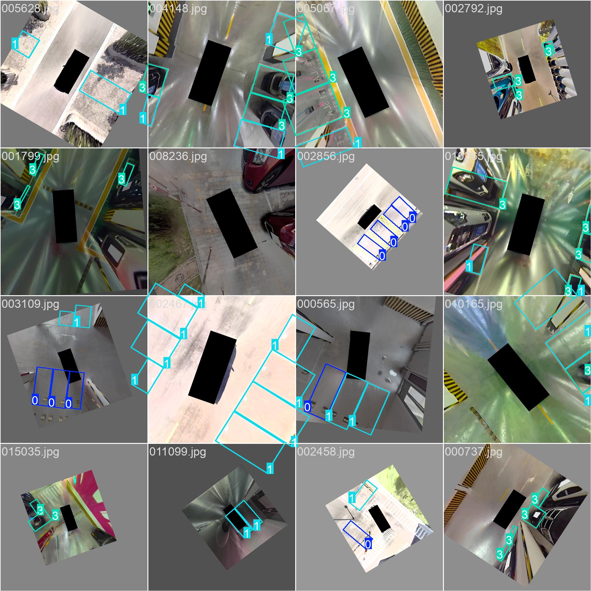
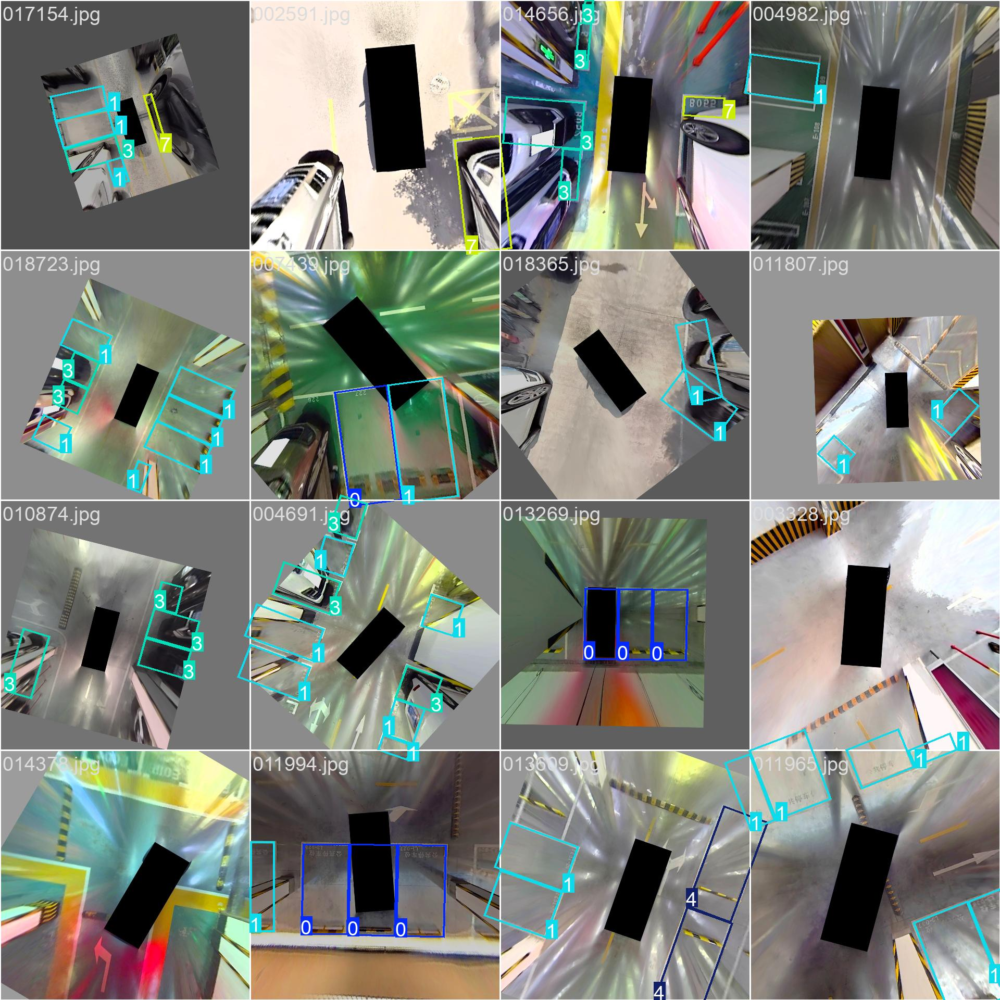
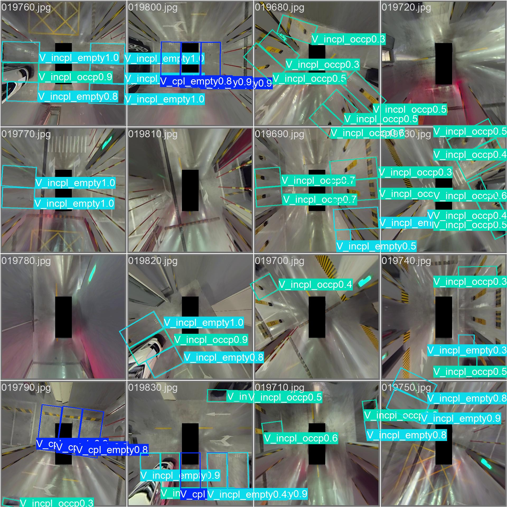
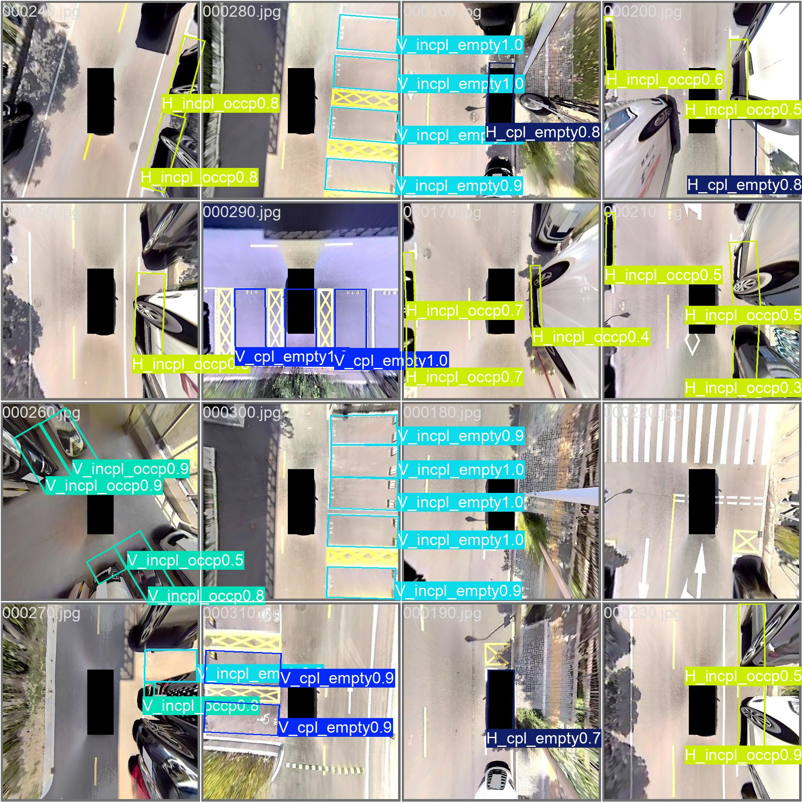
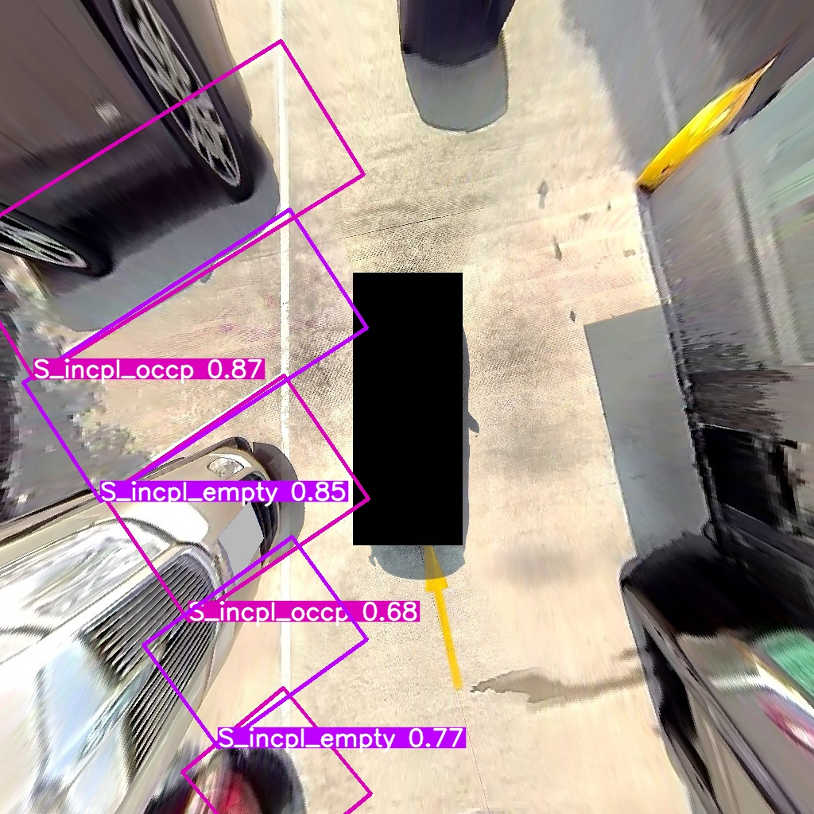
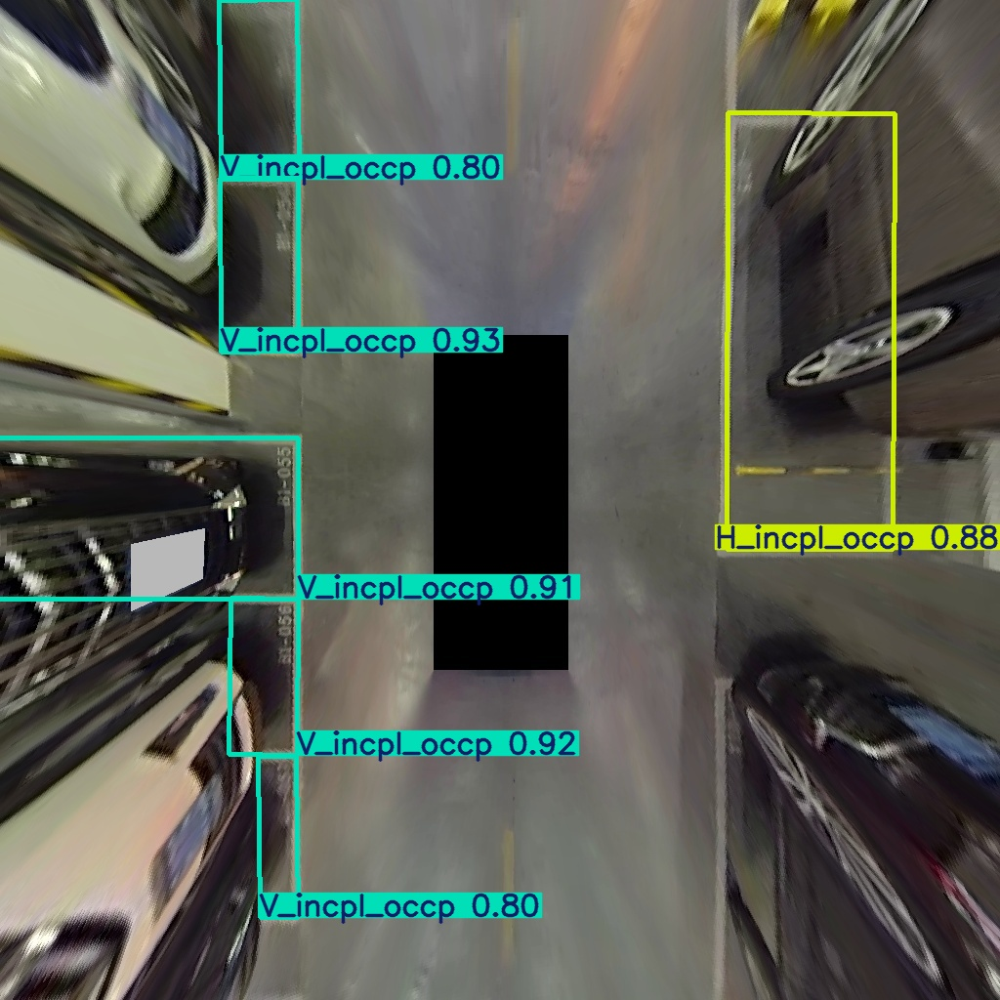
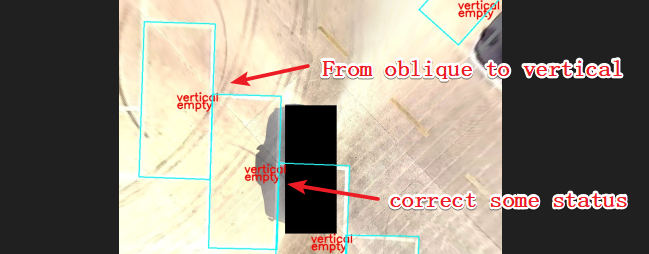

# 适用APA/AVP的AVM鸟瞰图的停车位检测（直出:车位+车位类型+车位完整性+占用状态）

## 1. 标签说明：（车位类型_完整性_占用状态）

* 车位类型：V（vertical parking slots），H（horizontal parking slots）,S（angled parking slots）
* 完整性：cpl（completely），incpl（incompletely）
* 占用状态：empty（empty），occp（occupy）

## 2.使用方法

训练基于YOLO进行，因此调用时需用到ultralytics库，训练时采用的图像大小为1024*1024

```python
# import pathlib
# pathlib.PosixPath = pathlib.WindowsPath #windows need

from ultralytics import YOLO

model = YOLO("result/weights/best.pt")
results = model.predict(source='your img path', save=True)
```

## 3.训练过程

当前使用了一万多张数据集进行训练，其中水平车位样本偏少，斜列车位样本最少

  

train_batch

  

val_batch

  

## 4.效果如下(V2)

  

## 5.尚存问题

斜列车位样本较少，还需增加样本，另外斜列车位矩形框无法提供其精确角点位置，实际部署时还需结合角点检测或其他方案

## 6.update log

* [X] 2026.8.19, version:0.0.0.1. Trained 80 epochs. The initial model was trained by directly finding the minimum bounding rectangle using a dataset of 20,000 Boden images.
* [X] 2026.8.26, version:0.0.0.2. Correct slots type：Correct the inclined vertical(origin is oblique)  to vertical , with "oblique" referring only to slant parking slots. Additionally, rectify other obvious errors in vertical and horizontal and status.


