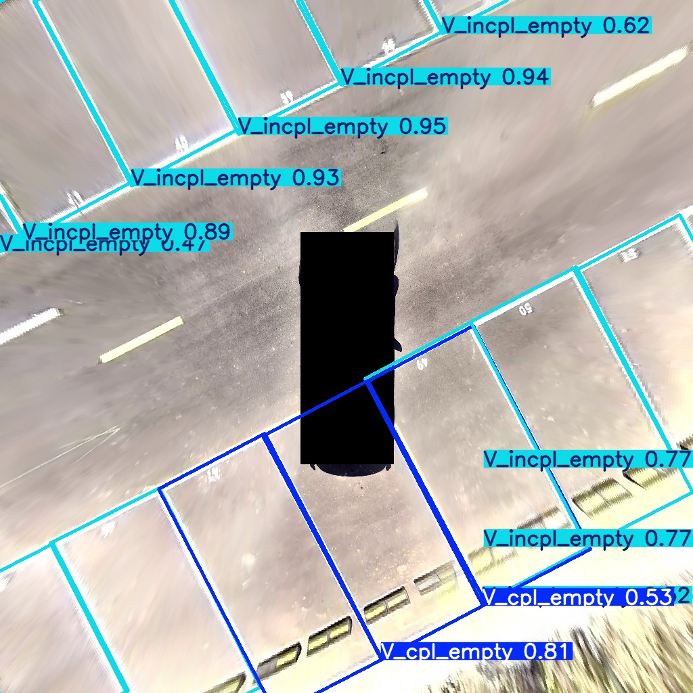

# 适用APA/AVP的AVM鸟瞰图的停车位检测（直出:车位+车位类型+车位完整性+占用状态）

## 1. 标签说明：（车位类型_完整性_占用状态）

* 车位类型：V（vertical parking space‌），H（horizontal parking space）,S（angled parking space）
* 完整性：cpl（completely），incpl（incompletely）
* 占用状态：empty（empty），occp（occupy）

## 2.使用方法

训练基于YOLO进行，因此调用时需用到ultralytics库

```python
# import pathlib
# pathlib.PosixPath = pathlib.WindowsPath #windows need

from ultralytics import YOLO

model = YOLO("result/weights/best.pt")


results = model.predict(source='your img path', save=True)
```


效果如下：


